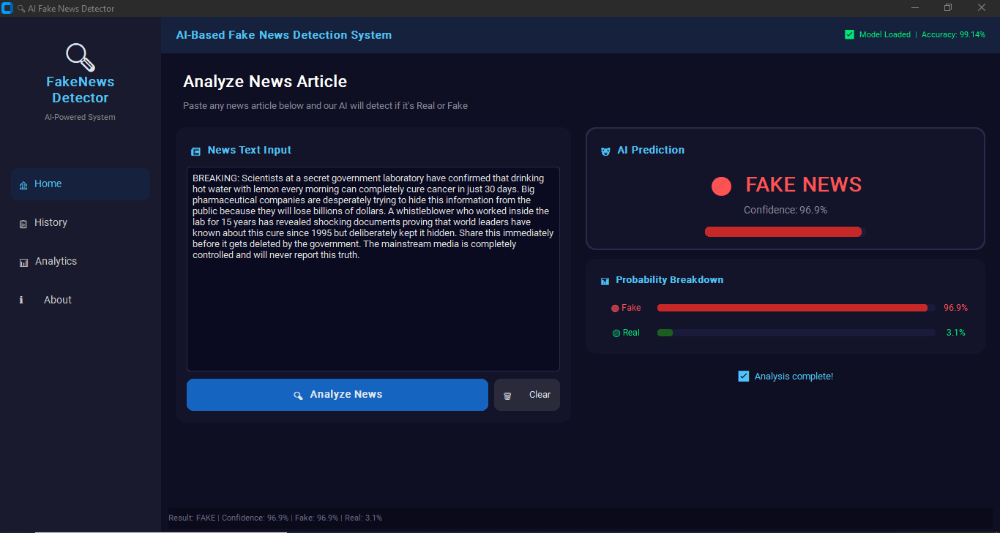
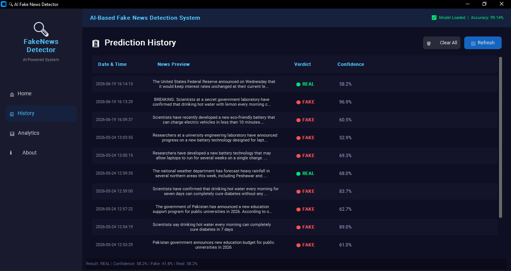
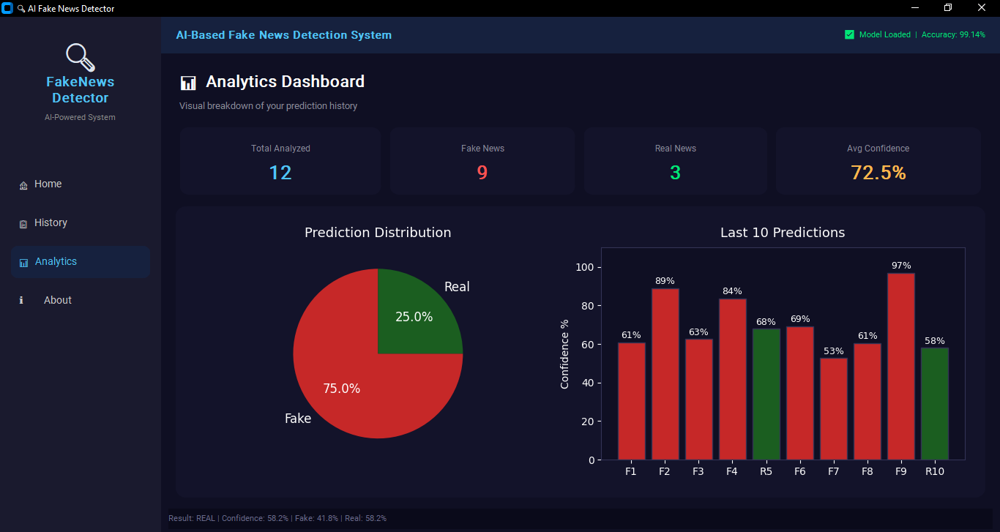
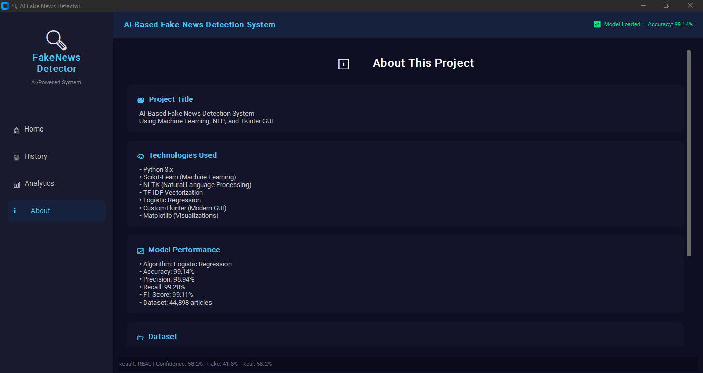

# 🔍 AI-Based Fake News Detection System

> An intelligent desktop application that automatically detects fake news
> using Machine Learning and Natural Language Processing.

---

## 📌 Project Overview

AI-powered Fake News Detection System designed to identify misleading and
unreliable news articles. Using Natural Language Processing (NLP) techniques
and a trained Logistic Regression model, the system classifies news content
as **REAL** or **FAKE** while providing prediction confidence scores.

The project covers the complete machine learning pipeline — from data
preprocessing and feature extraction to model training, evaluation, and
deployment-ready prediction workflows.

> ✅ Final Model Accuracy: **99.14%** on 44,898 real-world news articles

---

## ✨ Features

- 🤖 **AI-Powered Detection** — Logistic Regression with 99.14% accuracy
- 📊 **Confidence Score** — Probability breakdown for every prediction
- 🎨 **Modern Dark GUI** — Professional CustomTkinter interface
- 📋 **Prediction History** — All past predictions saved automatically
- 📈 **Analytics Dashboard** — Pie chart and bar chart visualizations
- 💾 **Persistent Storage** — JSON-based history system
- ⚡ **Background Threading** — UI stays responsive during analysis
- 🔄 **Two Models Compared** — Logistic Regression vs Naive Bayes

---

## 🧠 AI Pipeline

Raw Dataset (44,898 articles)

↓

NLP Preprocessing (NLTK)

— Lowercase → URL Removal → Special Chars → Stopwords → Stemming

↓

TF-IDF Vectorization (50,000 features)

↓

Train-Test Split (80% / 20%)

↓

Model Training (Logistic Regression + Naive Bayes)

↓

Model Evaluation & Comparison

↓

Best Model Saved (.pkl)

↓

Real-time GUI Prediction

---

## 📊 Model Performance

| Metric    | Logistic Regression | Naive Bayes | Winner |
| --------- | ------------------: | ----------: | ------ |
| Accuracy  |          **99.14%** |      96.39% | ✅ LR  |
| Precision |          **98.94%** |      96.50% | ✅ LR  |
| Recall    |          **99.28%** |      96.01% | ✅ LR  |
| F1-Score  |          **99.11%** |      96.25% | ✅ LR  |

**Why Logistic Regression?**

- Higher accuracy by 2.75%
- More reliable confidence/probability scores
- Industry standard for text classification
- Better handles large feature sets (50,000 TF-IDF features)

---

## 🗃️ Dataset

| Property      | Value              |
| ------------- | ------------------ |
| Source        | Kaggle             |
| Dataset Name  | Fake and Real News |
| Fake Articles | 23,481 (Label = 0) |
| Real Articles | 21,417 (Label = 1) |
| Total         | 44,898             |
| Features      | Title + Text       |

---

## 📁 Project Structure

fake_news_detector/

│

├── data/

│ ├── raw/ ← Fake.csv and True.csv

│ └── processed/

│

├── models/

│ ├── logistic_model.pkl ← Trained ML model

│ └── tfidf_vectorizer.pkl ← Saved TF-IDF vectorizer

│

├── src/

│ ├── data_loader.py ← Dataset loading

│ ├── preprocessor.py ← NLP preprocessing

│ ├── feature_engineer.py ← TF-IDF vectorization

│ ├── model_trainer.py ← Model training

│ ├── model_evaluator.py ← Evaluation metrics

│ └── predictor.py ← Real-time prediction

│

├── gui/

│ ├── main_window.py ← Main app window

│ ├── home_frame.py ← Analysis page

│ ├── history_frame.py ← History page

│ ├── analytics_frame.py ← Charts & stats

│ └── about_frame.py ← About page

│

├── history/

│ └── predictions.json ← Saved predictions

│

├── reports/

│ ├── model_report.txt ← Auto-generated evaluation

│ └── project_report.txt ← Full project report

│

├── train.py ← Run to train models

├── app.py ← Run to launch GUI

## └── requirements.txt ← All dependencies

## ⚙️ Installation & Setup

### Step 1 — Clone or Download Project

```bash
cd fake_news_detector
```

### Step 2 — Create Virtual Environment

```bash
python -m venv venv
venv\Scripts\activate
```

### Step 3 — Install Libraries

```bash
pip install -r requirements.txt
```

### Step 4 — Download NLTK Data

```bash
python -c "import nltk; nltk.download('stopwords'); nltk.download('punkt'); nltk.download('wordnet')"
```

### Step 5 — Add Dataset

Place Fake.csv and True.csv inside data/raw/

### Step 6 — Train the Model

```bash
python train.py
```

### Step 7 — Launch Application

```bash
python app.py
```

---

## 🛠️ Technologies Used

| Category      | Technology    | Purpose                       |
| ------------- | ------------- | ----------------------------- |
| Language      | Python 3.8+   | Main programming language     |
| ML Framework  | Scikit-Learn  | Models, TF-IDF, metrics       |
| NLP           | NLTK          | Stopwords, stemming, tokenize |
| GUI           | CustomTkinter | Modern dark theme interface   |
| Charts        | Matplotlib    | Pie chart, bar chart          |
| Data          | Pandas, NumPy | Dataset loading & processing  |
| Model Storage | Joblib        | Save/load .pkl model files    |

---

## 🖥️ GUI Pages

| Page         | Features                                           |
| ------------ | -------------------------------------------------- |
| 🏠 Home      | News input, Analyze button, FAKE/REAL result card  |
| 📋 History   | All past predictions with timestamp and confidence |
| 📊 Analytics | Pie chart, bar chart, stats cards                  |
| ℹ️ About     | Project info, technologies, model performance      |

---

## 📸 Screenshots

### 🏠 Home — News Analysis



### 📋 History Page



### 📊 Analytics Dashboard



### ℹ️ About Page



---

## 👨‍💻 Author

**Abubakar Ahmad**  
Python Developer & AI Engineer  
📍 Peshawar, Pakistan  
📧 abubakarahmad.ai.ml@gmail.com  
🔗 [github.com/abubakar-ahmad-ai](https://github.com/abubakar-ahmad-ai)

---

## 📄 License

This project is open source and available under the [MIT License](LICENSE).

---

## ⭐ Support

If you found this project helpful, please give it a **star** ⭐ on GitHub!  
It helps others discover this project.
